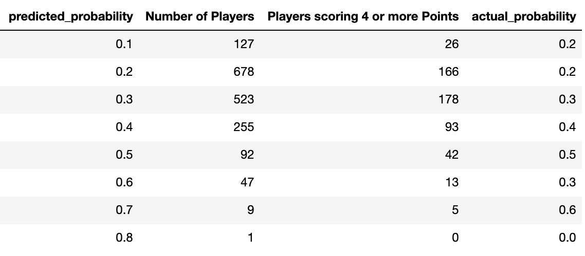
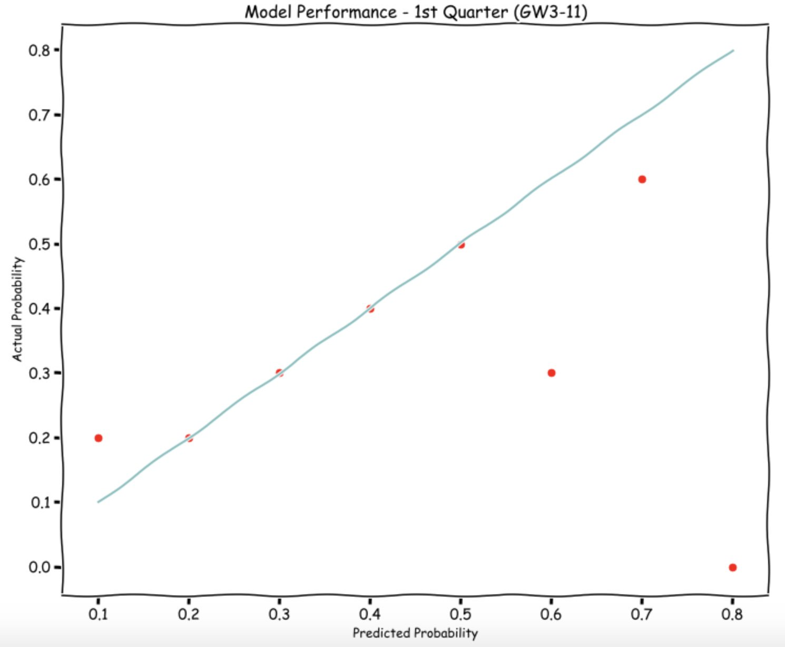

# FPL Classifier 2.0

This repo will contain all the model outputs of FPL classifier Model for each game week starting from game week 3. 

### Glossary

  - probability_hit - probability that the player will score 4 or more points in the upcoming gameweek.
  - points_last_gw - total points scored by the player in the game week that has ended recently. 

#### Validation

  Predictions from this repo will be compared with the actuals quaterly. Once in 9 game weeks. 

#### Model Performance

##### Q1 (Gameweek 3-11)

  

#### Read More
- [FPL Classifier 2.0 ](https://medium.com/datacomics/fpl-classifier-2-0-208d9e1e04da)
- [Building an FPL Captain Classifier](https://medium.com/datacomics/building-an-fpl-captain-classifier-cf4ee343ebcc) 

 

